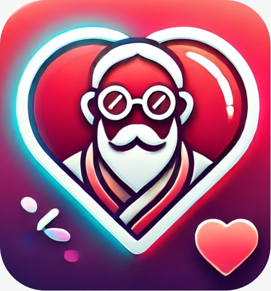

 

  

<h3 align="center">MisMatch</h3>

## About

### Welcome to MisMatch!

With us you can meet new people, but not as you know it, based on your interests. But based on your differences. True to the motto "what teases each other, loves each other". Sign up and start your adventure today!

### Built With

* [![Vue][Vue.js]][Vue-url]
* [![Spring][Spring.io]][Spring-url]

### Prerequisites

* Java 21 (https://adoptium.net/)

### Installation
Just run the main method in PowerDateBackend.java

<!-- MARKDOWN LINKS & IMAGES -->
<!-- https://www.markdownguide.org/basic-syntax/#reference-style-links -->

[Vue.js]: https://img.shields.io/badge/Vue.js-35495E?style=for-the-badge&logo=vuedotjs&logoColor=4FC08D

[Vue-url]: https://vuejs.org/

[Spring.io]: https://img.shields.io/badge/SpringBoot-6DB33F?style=flat-square&logo=Spring&logoColor=white

[Spring-url]: https://spring.io